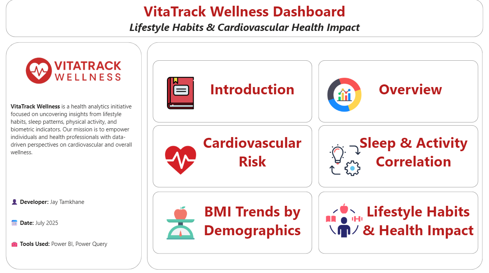
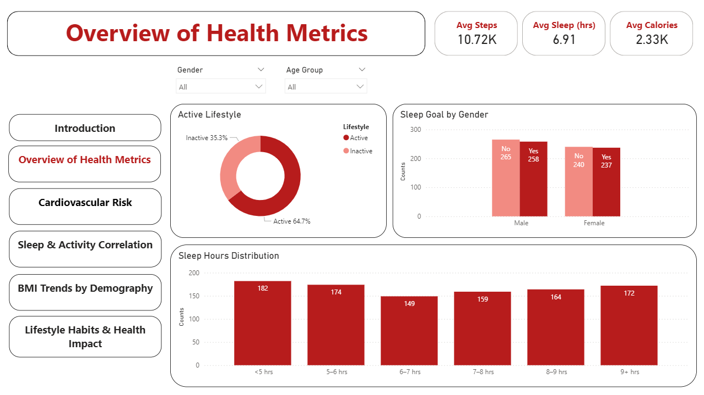
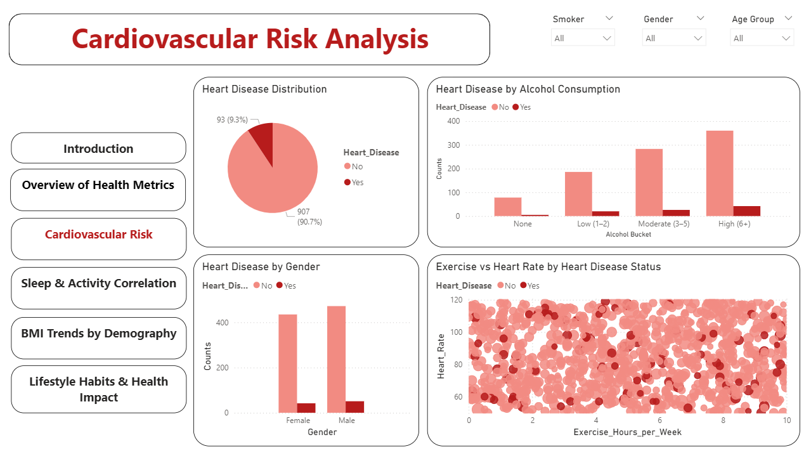
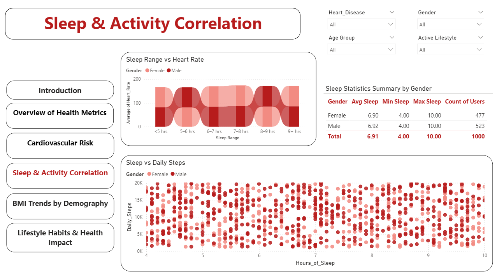
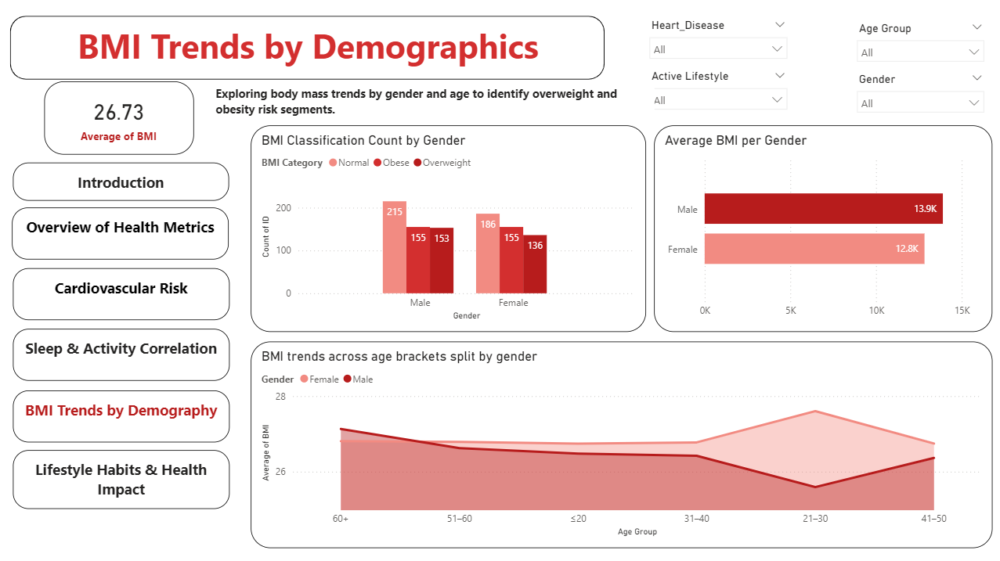
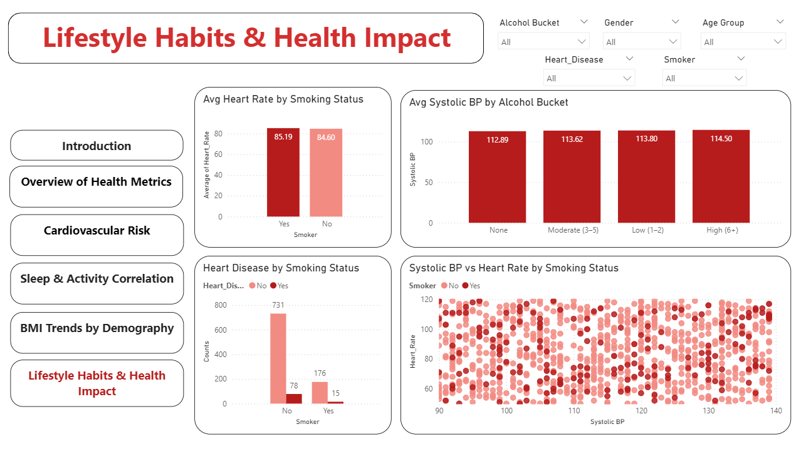

# VitaTrack Wellness - Lifestyle Health Insights Dashboard 🩺
VitaTrack Wellness is a health analytics initiative focused on uncovering insights from lifestyle habits, sleep patterns, 
physical activity, and biometric indicators. Our mission is to empower individuals and health professionals with data-driven 
perspectives on cardiovascular and overall wellness.

## 🔍 Project Objective
VitaTrack Wellness, a digital health company based in FitZone, tracks user health through smart devices. As their data analyst,
your goal was to build a Power BI dashboard to analyze lifestyle habits and provide insights to:

* Promote preventive care
* Identify cardiovascular health risks
* Suggest data-driven lifestyle improvements

## 📁 Questions Addressed

1. Are users maintaining a balanced lifestyle in terms of daily steps, calories intake, and sleep?
2. Identify users at risk of heart disease based on habits (e.g., smoking, alcohol).
3. Analyze the relationship between sleep and physical activity.
4. Explore how BMI varies across age groups and genders.
5. Study the impact of smoking and alcohol on heart rate and blood pressure.
6. Segment people based on health activity and suggest lifestyle changes.

## 📁 Dashboard Pages

### 📌 Page 1: Introduction
- Overview of key health and wellness themes explored in the dashboard.

---

### 📊 Page 2: Health Metrics Overview
- Avg Steps: 10.72K | Avg Sleep: 6.91 hrs | Avg Calories Burned: 2.33K
- Insight: While 64.7% are active, only 35% meet the sleep goal.

---

### ❤️ Page 3: Cardiovascular Risk Analysis
- 9.3% of users have heart disease.
- Risk increases with alcohol, elevated heart rate, and gender factors.

---

### 🛌 Page 4: Sleep & Activity Correlation
- Lower sleep hours are linked with higher heart rate.
- Scatter plot shows weak link between steps and sleep.

---

### ⚖️ Page 5: BMI by Age & Gender
- Avg BMI: 26.73 (Overweight threshold).
- Obesity more common in 21–30 and 60+ age groups.

---

### 🚬 Page 6: Lifestyle Habits & Health Impact
- Heart rate slightly higher in smokers.
- Alcohol use strongly correlates with increased systolic BP and heart disease.

---

## 📈 Key Insights

1. Only 35% of users met the recommended 7+ hrs sleep.
2. Heart disease links closely with alcohol consumption and high resting heart rate.
3. Obesity trends spike in early adulthood and post-60s age group.
4. Gender and substance use significantly impact health metrics.

---

## 🧠 Learnings

- Built a multi-page, insight-driven Power BI report aligned with real-world health concerns.
- Applied DAX for condition-based metrics like Sleep Goal Met & BMI classification.
- Practiced data storytelling using slicers, visuals, and segmentation techniques.
- Gained hands-on experience in building healthcare-focused dashboards.

---

## 📎How to Use This Project

- Download the .pbix file and open in Power BI Desktop
- Use slicers to filter insights by gender, age, health condition, etc.
- Navigate through pages to explore sleep, activity, BMI, and risk profiles

---

## 🙋 Author
Jaykumar Tamkhane

- 📧 Email: jaytamkhane161@gmail.com
- 🔗 LinkedIn: linkedin.com/in/jaytamkhane
